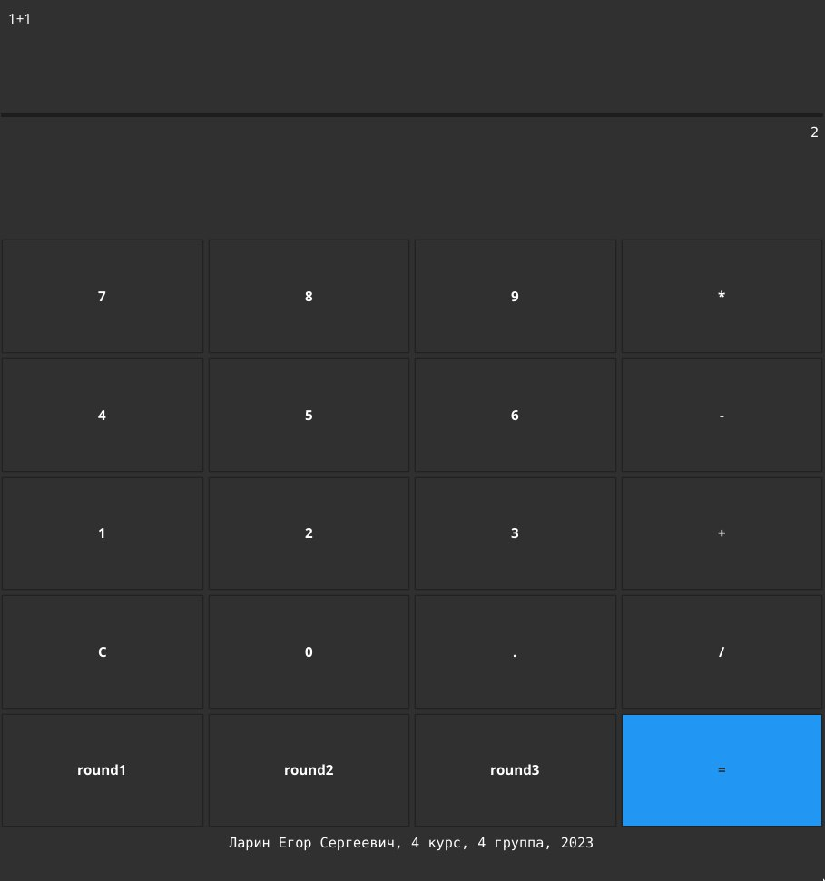

# Dependencies
- Go 1.21.1
- XLib `sudo apt-get update && sudo apt-get install gcc libgl1-mesa-dev libegl1-mesa-dev libgles2-mesa-dev libx11-dev xorg-dev libwayland-dev libxkbcommon-dev bc`
# Build
`go build ./cmd/calc`
# Try built binary
Find latest release with `calc` executable for Linux/amd64.
Change permissions to executable with `chmod +x calc` and simply run with `./calc`.
# Demo
